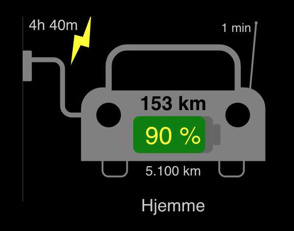
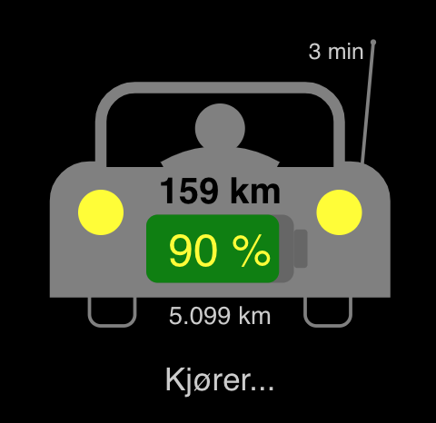

# MMM We Connect

Module for [MagicMirror](https://github.com/MichMich/MagicMirror/) showing data from your car using We Connect from Volkswagen, formerly known as Car-Net. 

The module shows a car sketch with information whether the car is connected to charging cable or not, charging or not, or if it is driving or parked. Based on configuration, it may also show where the car is parked, or how far away from home it is parked. It also shows how much energy is on the battery, end estimated range, as well as the total distance counter of the car.

The solution is using the We Connect login page in order to get a key, and is after that using an API for retrieving data, the same API as the We Connect app is using. Unfortunately the login procedure has do be done every time data is fetched in order to get refreshed data, so refresh should not be done too often.

Of course, you must have a We Connect subscription with username and password, and you should log in to the [We Connect portal](https://www.portal.volkswagen-we.com/portal) before using this module.

I have only tested this with my eGolf, and it may behave differently with other models. I assume it also may behave a little different in other countries than Norway, where I have tested it. 

Feel free to help adapting it to other models.

Here are my other [modules for MagicMirror](https://github.com/ottopaulsen/magic).


## Screenshot

The car is connected and charging:



The car is driving:




## Installation

Go to your `MagicMirror/modules` folder and write

    git clone https://github.com/ottopaulsen/MMM-WeConnect
    cd MMM-WeConnect
    npm install


## Configuration

Here is an example configuration. Put it in the `MagicMirror/config/config.js` file:
``` javascript
    {
        module: 'MMM-WeConnect',
        position: 'bottom_left',
        config: {
            email: '<we-connect.username>',
            password: '<we-connect-password>',
            refreshIntervalSeconds: 180,
            size: 300, // This is the size of the drawing
            showDistance: true,
            showPosition: true,
            showBatteryPercent: true,
            showRange: true,
            showConnectionStatus: true,
            showDriving: true,
            showBattery: true,
            logging: false, // Write some data to console.log()
            colors: {
                car: "gray",
                text: "#ccc",
                rangeText: "black",
                chargingSign: "yellow",
                lightsOn: "yellow",
                lightsOff: "#222",
                wheels: "#222"
            },
            batteryColors: [
                { upTo: 20, background: "pink", forground: "red", text: "yellow" },
                { upTo: 50, background: "pink", forground: "orange", text: "yellow" },
                { upTo: 75, background: "#666", forground: "blue", text: "yellow" },
                { upTo: 100, background: "#666", forground: "green", text: "yellow" }
            ],
            positions: [
                {name: "Hjemme", lat: 63.430484,  lon: 10.394966, marginMeters: 50},
                {name: "Trondheim Spektrum", lat: 63.426559, lon: 10.376309, marginMeters: 100},
                {name: "City Lade", lat: 63.444426, lon: 10.446577, marginMeters: 200}
            ],
            homePosition: "Hjemme"
        }
    },
```


Add entries for the positions you want to show with specific text (name). 

The homePosition should be set to the name of the position that represents home. This makes it possible to show how far away from home the car is, when it is not at any known position.

If you want other languages, add your own translation file in the translations folder.

The logging can be set to `true` to output data to the console. It can be useful for example to get positions, but you can easily also use Google Maps for this.

### Privacy

Please respect peoples privacy rights, and do not show position unless all drivers and passangers agree to this. This is your responsibility.

### Password security

You must keep your We Connect username and password secret!
If anyone gets hold of them, they can potentially steal your car, or do other harm!

They are only used on the login procedure, but they persist in the configuration and may turn up in logs!

### CSS Styling

If you want to use CSS to style the drawing, the element id's below are available, but I have not really tried, and I do not know if it is very convenient.

```
car
left_wheel
right_wheel
car_body
left_light
right_light
cable_connected
cable_disconnected
charger_box
wall
charging
battery
battery_body
battery_top
battery_level
driver
driver_head
antenna
antenna_top
distance
battery_percent
range
remaining_charging_time
position
last_connection
```

## Contributions

Grate thanks to [reneboer](https://github.com/reneboer), [Mirarkitty](https://github.com/Mirarkitty), [jaybora](https://github.com/jaybora), [Sneak-L8](https://github.com/Sneak-L8), [youpixel](https://github.com/youpixel), [birgersp](https://github.com/birgersp) and many others contributing to get the login procedure working, and for other information about the API. I specially leaned on [reneboer/python-carnet-client](https://github.com/reneboer/python-carnet-client) to get my Javascript version working.

If you want to help improving this module, that would be nice. Pull requests are welcome, but it may be better to create issues first, so we can discuss what kind of changes to make, and how to design the solution.

Here are some improvements I have been thinking of, but not started:

* Choose to show information in table or other form, instead of the drawing.
* Improve the drawing. Not my profession...
* Better support for other models, for example hybrid cars. I am not going to do that myself.
* Show how long time or distance until next service.
* Warn when it is getting close to service time.

If you find bugs, please investigate them by turning on logging in the config, and create an issue containing the logged information, especially the information retrieved by node_helper from the We Connect API. NB! Keep your passward safe!


